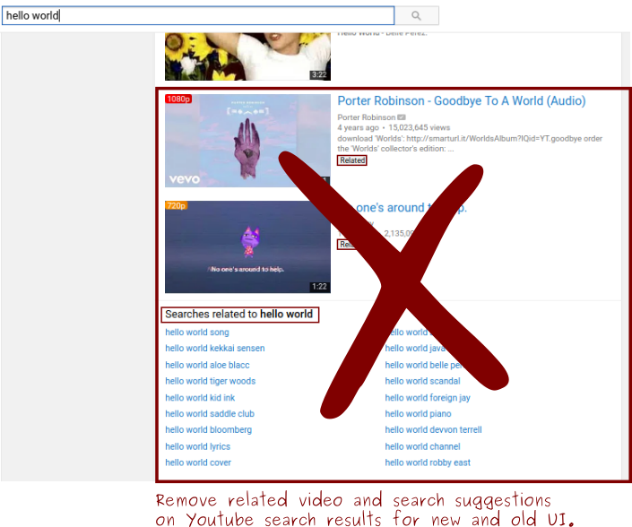

#Cleanup Youtube search results
A userscript to remove related video and search suggestions on Youtube search results for new and old UI.
You can install it to different browsers with Tempermonkey extension/addon.    
[Script link(OpenUserJS)](https://openuserjs.org/scripts/abdullahoguk/Cleanup_Youtube_Search_results)

Works for Turkish and English for now. 
Add `|what is written in "Related" badge in your language` at the end of `İlgili video` to get it working for different languages or create issue. 
sections 
 

